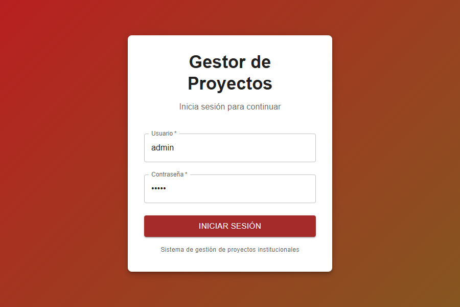

# Dashboard de Proyectos

Sistema de gestión de proyectos institucionales con autenticación de usuarios, roles y administración de proyectos.

## 🚀 Características

- **Autenticación de Usuarios**: Login seguro con verificación de credenciales
- **Gestión de Perfiles**: Edición de perfil con cambio de nombre, email, rol y contraseña
- **Control de Acceso por Roles**: Diferentes permisos según el rol asignado
- **Gestión de Proyectos**: CRUD completo de proyectos institucionales
- **API REST**: Backend construido con Node.js, Express y PostgreSQL
- **Frontend Moderno**: React con Material-UI
- **Avance Trimestral**: Seguimiento de avance por trimestre con registro de razones, obstáculos y documentación
- **Gestión de Reportes**: Sistema completo de reportes por proyecto y unidad administrativa
- **Presupuesto y Asignaciones**: Control de presupuesto y asignaciones por proyecto

## 📁 Estructura del Proyecto

```
/
├── backend-api/          # API REST (Node.js + Express + PostgreSQL)
│   ├── database/         # Scripts SQL
│   ├── src/
│   │   ├── controllers/  # Controladores
│   │   ├── routes/       # Rutas de la API
│   │   └── ...
│   └── package.json
│
└── Gestor de proyectos/  # Frontend (React + Vite + Material-UI)
    └── frontend/
        ├── src/
        │   ├── components/  # Componentes React
        │   ├── pages/       # Páginas
        │   ├── services/    # Servicios API
        │   └── context/     # Contextos (Auth, etc.)
        └── package.json
```

## 🛠️ Tecnologías

### Backend
- Node.js
- Express.js
- PostgreSQL
- CORS
- Morgan (logging)

### Frontend
- React 19
- Vite
- Material-UI (MUI)
- React Router DOM
- Axios

## ⚙️ Instalación

### 1. Clonar el repositorio

```bash
git clone https://github.com/lysanderNocturn/Dashboard-Proyectos.git
cd Dashboard-Proyectos
```

### 2. Configurar el Backend

```bash
cd "backend-api"
npm install
```

- Configurar la base de datos PostgreSQL (ver `database/db.sql`)
- Crear archivo `.env` con las credenciales de la base de datos
- Ejecutar seed data: `database/seed_data.sql`
- Ejecutar migraciones si es necesario: `database/migration_v4.sql` (agrega campos: razon, obstaculos, documentacion_adjunta)

```bash
npm run dev
```

El backend correrá en `http://localhost:4000`

### 3. Configurar el Frontend

```bash
cd "Gestor de proyectos/frontend"
npm install
npm run dev
```

El frontend correrá en `http://localhost:3000`

## 🔐 Credenciales de Prueba

- **Usuario**: `admin`
- **Contraseña**: `admin`

O usa cualquier usuario de la base de datos con contraseña `admin` o `123456`.

## 📚 Endpoints de la API

### Autenticación
- `POST /auth/login` - Iniciar sesión
- `POST /auth/verify-password` - Verificar contraseña
- `POST /auth/change-password` - Cambiar contraseña

### Usuarios
- `GET /users` - Obtener todos los usuarios
- `GET /users/:id` - Obtener usuario por ID
- `POST /users` - Crear usuario
- `PUT /users/:id` - Actualizar usuario
- `DELETE /users/:id` - Eliminar usuario

### Proyectos
- `GET /proyectos` - Obtener todos los proyectos
- `GET /proyectos/:id` - Obtener proyecto por ID
- `POST /proyectos` - Crear proyecto
- `PUT /proyectos/:id` - Actualizar proyecto
- `DELETE /proyectos/:id` - Eliminar proyecto

### Reportes
- `GET /reportes` - Obtener todos los reportes (con filtros)
- `GET /reportes/proyecto/:proyecto_id` - Obtener reportes por proyecto
- `GET /reportes/unidad/:unidad_id` - Obtener reportes por unidad administrativa
- `GET /reportes/:id` - Obtener reporte por ID
- `POST /reportes` - Crear reporte
- `PUT /reportes/:id` - Actualizar reporte
- `DELETE /reportes/:id` - Eliminar reporte

### Actividades Ejecutadas
- `GET /actividades-ejecutadas` - Obtener actividades ejecutadas
- `POST /actividades-ejecutadas` - Crear actividad ejecutada (con campos: razon, obstaculos, documentacion_adjunta)
- `PUT /actividades-ejecutadas/:id` - Actualizar actividad ejecutada

### Roles
- `GET /roles` - Obtener todos los roles
- `GET /roles/:id` - Obtener rol por ID

## 📝 Funcionalidades del Perfil

La ventana de perfil permite:

1. **Visualizar datos del perfil**:
   - Nombre de usuario
   - Email
   - Rol asignado
   - Fecha de creación

2. **Editar perfil** (requiere confirmación con contraseña):
   - Cambiar nombre de usuario
   - Cambiar email
   - Cambiar rol (desde lista de roles disponibles)

3. **Cambiar contraseña** (requiere confirmación):
   - Verificar contraseña actual
   - Ingresar nueva contraseña
   - Confirmar nueva contraseña

## 👥 Roles Disponibles

Los roles se gestionan desde la base de datos en la tabla `roles`:
- Administrador
- Director
- Usuario
- etc.

## 🎨 Capturas de Pantalla



## 📄 Licencia

Este proyecto es privado y fue desarrollado para fines institucionales.

## 🤝 Contribución

Desarrollado por Pedro Ruiz. (posadanomuertos@gmail.com)

---

**Nota**: Este proyecto utiliza un sistema de autenticación simplificado para propósitos de demostración. En un entorno de producción, se recomienda implementar:
- Hashing de contraseñas con bcrypt
- JWT (JSON Web Tokens) para autenticación
- HTTPS/TLS
- Validación más robusta de entradas
